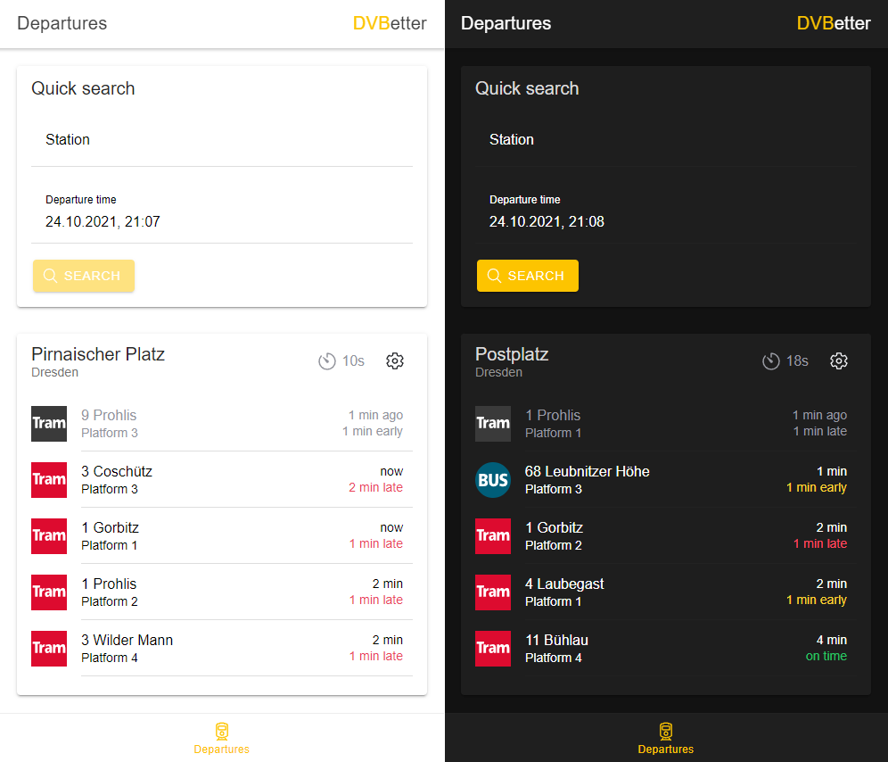

# dvbetter

An attempt at fixing the god-awful mobile app of Dresdner Verkehrsbetriebe.

## Using the app

DVBetter is available to use at [https://benjamin-hempel.github.io/dvbetter](https://benjamin-hempel.github.io/dvbetter). On supported browsers, you can even install it as a PWA!

## About this project

Most of the times I open the official app of Dresdner Verkehrsbetriebe it doesn't end well. Everything's fine and dandy when suddenly the app becomes unresponsive or outright crashes on me. Oh, you want to *arrive* at that stop at the time you chose? Well, I didn't save your last input correctly so now you'll instead *depart* at that time. I could go on and on about all the little problems, nonsensical menu structure and usability issues, but instead I decided to just create my own app called DVBetter.

### Features

DVBetter currently offers the following features. If you'd like to see what's coming in the future, take a look at the [roadmap](https://github.com/benjamin-hempel/dvbetter/projects/1).

* departure monitor
    * quickly find real-time departures of any stop within the Verkehrsverbund Oberelbe network, including delays and cancellations
    * bookmark your favorite stations to see their next departures at a glance
    * choose how many departures to display for each bookmarked station individually
    * automatically refresh departures to always see the latest information
* light or dark mode depending on system theme

## FAQ

### Where and how is my data stored and processed?

DVBetter stores all user data only locally on your device using [PouchDB](https://pouchdb.com/). Of course, to get departures and routes, DVBetter needs to send that information to the appropriate APIs of Dresdner Verkehrsbetriebe and Verkehrsverbund Oberelbe. For this, the open-source library [dvbjs](https://github.com/kiliankoe/dvbjs) is used. Please also note that GitHub may collect data, create logs and set cookies according to their [Privacy Statement](https://docs.github.com/en/github/site-policy/github-privacy-statement) as the app is hosted using GitHub Pages. If you don't like that, you can of course simply host DVBetter yourself by following the steps outlined below.

### Are you planning to monetize DVBetter in the future?

I currently have no plans to monetize the app, which means there will be no ads and DVBetter will remain free-to-use for the foreseeable future. I'm developing this app for fun and to learn stuff, not to make money. Thanks to GitHub Pages, I also don't have any running costs for hosting DVBetter.

## Running and building the app

### Prerequisites

DVBetter requires the following software to run locally:

* [Node.js](https://nodejs.org) (tested using v14.18.1 LTS)
* [Yarn](https://yarnpkg.com/) (tested using [v3.0.2](https://yarnpkg.com/getting-started/migration))
* [Ionic CLI](https://ionicframework.com/docs/cli) (tested using v6.17.1)

Furthermore, you need to run `yarn install` in the project directory to install all required dependencies.

### Running a development server

When all prerequisites are met, you can start up a local development server by running `ionic serve` in the project directory. The app should then be available at `http://localhost:8100/dvbetter`.

### Building the app

To build a production version of the app, simply run `ionic build --prod` in the project directory. This will create a `www` folder in the project directory that contains the build output. 

Please note that this presumes the app's base href to be `/dvbetter/`. To change this, simply modify or remove the `projects.app.architect.build.options.baseHref` property in `angular.json`.

## Contributing

I am currently not accepting pull requests as this app is a hobby and learning experience for me, so I'd like to write all of the code myself. 

However, if you'd like to report a bug or request a new feature, head over to the [issues section](https://github.com/benjamin-hempel/dvbetter/issues). Before creating a new issue, please check if there's already an issue covering your report/request.

## Attributions

This section contains the libraries and technologies used to power DVBetter as well as their respective licenses.

* Ionic Framework ([Website](https://ionicframework.com/), [GitHub](https://github.com/ionic-team/ionic-framework), [MIT license](https://github.com/ionic-team/ionic-framework/blob/main/LICENSE))
* Angular ([Website](https://angular.io/), [GitHub](https://github.com/angular/angular), [MIT license](https://github.com/angular/angular/blob/master/LICENSE))
* PouchDB ([Website](https://pouchdb.com/), [GitHub](https://github.com/pouchdb/pouchdb), [Apache 2.0 license](https://github.com/pouchdb/pouchdb/blob/master/LICENSE))
* dvbjs ([GitHub](https://github.com/kiliankoe/dvbjs), [MIT license](https://github.com/kiliankoe/dvbjs/blob/master/LICENSE))
* date-fns ([Website](https://date-fns.org/), [GitHub](https://github.com/date-fns/date-fns), [MIT license](https://github.com/date-fns/date-fns/blob/master/LICENSE.md))
* angular-cli-ghpages ([GitHub](https://github.com/angular-schule/angular-cli-ghpages), [MIT license](https://github.com/angular-schule/angular-cli-ghpages/blob/master/LICENSE))

I'd also like to thank [Richard Böhme](https://github.com/richardboehme) for helping with testing the app and providing feedback.